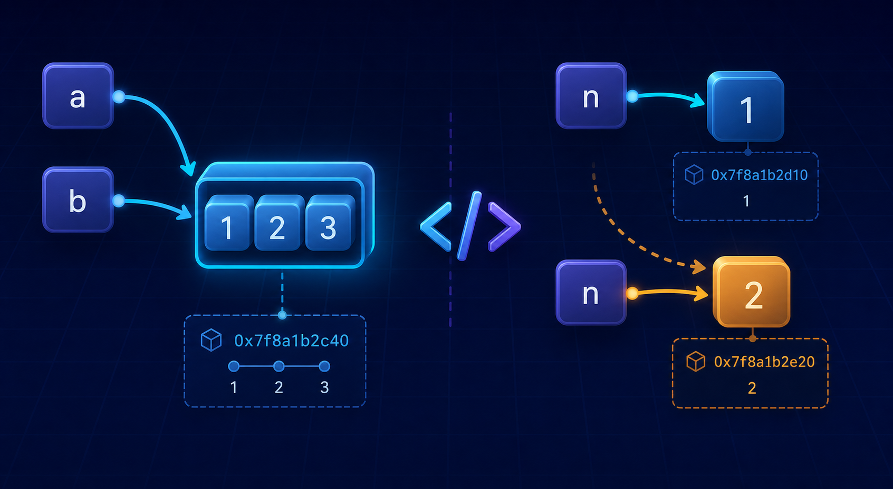

# Python: Everything Is an Object



## Introduction

Python becomes much easier to reason about once we stop thinking of variables as boxes that contain values. Everything in Python is an object, and a variable is a name bound to an object. An object has an identity, a type, and a value. Some objects can change after creation, while others cannot. Those few ideas explain why two equal values may or may not be the same object, why changing one list can affect another variable, and why an integer passed to a function behaves differently from a list.

## Identity and type

The built-in `type()` function reports an object's type. The built-in `id()` function returns its identity: an integer that is unique for the object during its lifetime. In CPython, that identity represents the object's memory address, although other Python implementations do not have to use an address. The `==` operator compares values, while `is` compares identities.

```python
a = [1, 2, 3]
b = [1, 2, 3]

print(type(a))   # <class 'list'>
print(a == b)    # True: their values are equal
print(a is b)    # False: they are different objects
print(id(a) == id(b))  # False
```

Assignment does not copy an object. It binds a name to a reference. Therefore, `b = a` makes `b` an alias of `a`: both names refer to the same object.

```python
a = [1, 2, 3]
b = a
print(a is b)  # True
```

The first memory schema looks like this:

```text
a ─────┐
       ├────> list object [1, 2, 3] at identity 0x100
b ─────┘
```

## Mutable objects

A mutable object can be changed in place without changing its identity. Common mutable built-in types are `list`, `dict`, `set`, and `bytearray`. When aliases point to one mutable object, a mutation made through either name is visible through both names.

```python
scores = [10, 20]
alias = scores
before = id(scores)

alias.append(30)

print(scores)               # [10, 20, 30]
print(alias)                # [10, 20, 30]
print(id(scores) == before) # True
```

The object's contents changed, but the two references and the list's identity stayed the same:

```text
Before: scores ─┐
                ├──> [10, 20]     (identity 0x200)
        alias ──┘

After:  scores ─┐
                ├──> [10, 20, 30] (identity 0x200)
        alias ──┘
```

This aliasing mechanism is useful when shared state is intentional, but it can also cause surprising bugs. To make an independent shallow copy of a list, use slicing, `list.copy()`, or `list(original)`.

```python
original = [1, 2, 3]
copy = original[:]
copy.append(4)

print(original)          # [1, 2, 3]
print(copy)              # [1, 2, 3, 4]
print(copy is original)  # False
```

## Immutable objects

An immutable object's value cannot be changed after creation. The main immutable built-in types are numbers (`int`, `float`, and `complex`), `str`, `tuple`, `frozenset`, and `bytes`. An operation that appears to change an immutable value actually creates or selects another object and rebinds the name.

```python
n = 1
before = id(n)
n += 1

print(n)                # 2
print(id(n) == before)  # False in the usual CPython case
```

The second memory schema shows rebinding rather than mutation:

```text
Before: n ─────> integer object 1 (identity 0x300)

After:  n ─────> integer object 2 (identity 0x320)
                  integer object 1 is unchanged
```

Immutability describes the outer object, not necessarily everything reachable from it. A tuple cannot have its slots replaced, but a slot may refer to a mutable object whose contents can change.

```python
t = ([1, 2], "fixed")
t[0].append(3)
print(t)  # ([1, 2, 3], 'fixed')
```

A `frozenset` is also immutable, but its elements must be hashable. This prevents ordinary mutable built-ins such as lists, dictionaries, and sets from being direct elements. A custom hashable object may still have mutable internal state, though mutating any state involved in its hash would violate hash-table rules and should be avoided.

## Why mutability matters

Mutability determines whether an operation changes an existing object or binds a name to another object. For a list, `+=` normally mutates the list in place, so aliases see the update. By contrast, `a = a + [4]` creates a new list and rebinds only `a`.

```python
a = [1, 2, 3]
b = a
a += [4]
print(b)       # [1, 2, 3, 4]
print(a is b)  # True

x = [1, 2, 3]
y = x
x = x + [4]
print(y)       # [1, 2, 3]
print(x is y)  # False
```

The same distinction matters when choosing dictionary keys and set elements: those positions require hashable objects whose hash remains stable. Immutable types are often hashable, while mutable containers are not. It also matters when designing APIs, sharing data between parts of a program, caching results, and deciding whether a defensive copy is needed.

CPython further optimizes commonly used immutable integers. At startup it creates a cache containing 262 small integer objects, from `-5` through `256` inclusive. In CPython source these ranges have historically been described by `NSMALLNEGINTS` (5 negative integers) and `NSMALLPOSINTS` (257 non-negative integers). Modern source names may include an internal prefix, but the idea is the same. These values were chosen because small integers are used constantly for indexes, counters, lengths, status values, and Boolean-like calculations. Reusing them saves allocations and improves performance.

```python
a = 89
b = 89
print(a is b)  # Commonly True in CPython because 89 is cached
```

Identity reuse is an implementation detail, so `is` must not be used for numeric or string value comparison. Use `==` for values and reserve `is` for identity checks, especially `value is None`.

## Passing arguments to functions

Python passes arguments by assignment, sometimes described as call-by-sharing. Calling a function binds each parameter name to the same object referenced by the corresponding argument. The function does not receive a separate variable box, and the reference itself is not passed by reference. If the function mutates a shared mutable object, the caller sees the change. If it rebinds the parameter, the caller's name is unaffected.

```python
def add_item(items):
    items.append(4)

numbers = [1, 2, 3]
add_item(numbers)
print(numbers)  # [1, 2, 3, 4]
```

Here, `items` and `numbers` are temporary aliases for the same list. The function mutates that list.

```python
def replace(items):
    items = [9, 9, 9]

numbers = [1, 2, 3]
replace(numbers)
print(numbers)  # [1, 2, 3]
```

Here, assignment only rebinds the local parameter `items`; it does not rebind `numbers`. Immutable arguments make the same rule especially visible:

```python
def increment(value):
    value += 1
    print(value)  # 2

number = 1
increment(number)
print(number)     # 1
```

Because an integer cannot be mutated, `value += 1` creates or selects the integer `2` and locally rebinds `value`. The caller's `number` still refers to `1`. Understanding identity, aliases, mutability, rebinding, and argument passing turns these results from Python “tricks” into predictable consequences of one consistent object model.

## Publication links

- Blog post: add the Medium or LinkedIn article URL after publishing.
- LinkedIn share: add the LinkedIn post URL after sharing.
