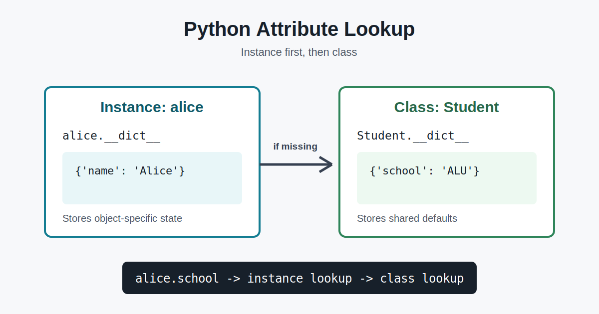

# Python Class and Instance Attributes: Ownership, Lookup, and `__dict__`

Python objects become much easier to reason about once you know where their
attributes live and how Python finds them. This article explains classes,
instances, class attributes, instance attributes, and the lookup rules that
connect them.

## Classes, instances, and attributes

A **class** is a blueprint that defines the data and behavior shared by a kind
of object. An **instance** is one concrete object created from that class. An
**attribute** is a named value attached to either the class or an instance.

```python
class Student:
    school = "ALU"

    def __init__(self, name):
        self.name = name


alice = Student("Alice")
```

Here, `Student` is a class, `alice` is an instance, `school` is a class
attribute, and `name` is an instance attribute.

## Class attributes

A class attribute belongs to the class and is shared through attribute lookup
by its instances. The Pythonic way to create one is to assign it in the class
body:

```python
class ApiClient:
    API_VERSION = "v1"
    timeout = 30
    active_clients = 0
```

Class attributes are useful for:

- constants, such as `API_VERSION`;
- shared default values, such as `timeout`;
- values tracked across instances, such as `active_clients`.

They avoid duplicating the same value in every instance. Their main drawback
is shared state: changing a mutable class attribute, such as a list, can affect
every instance unexpectedly.

## Instance attributes

An instance attribute belongs to one specific object. The Pythonic place to
create required instance attributes is `__init__`:

```python
class Student:
    def __init__(self, name, score=0):
        self.name = name
        self.score = score
```

Each student can now have a different `name` and `score`. Instance attributes
are ideal for object-specific state. Their tradeoff is that each instance
stores its own values, which uses more memory than one shared class value.

Python also permits attributes to be created later:

```python
alice.nickname = "Ace"
```

This is valid, but defining expected state in `__init__` is clearer because
every initialized object then has a predictable shape. Properties are the
Pythonic choice when assignment needs validation or computed behavior:

```python
class Rectangle:
    def __init__(self, width):
        self.width = width

    @property
    def width(self):
        return self._width

    @width.setter
    def width(self, value):
        if value < 0:
            raise ValueError("width must be >= 0")
        self._width = value
```

## Attribute lookup flow

For a normal expression such as `alice.school`, Python first checks whether
`school` is a public attribute of `alice`. If it is not found on the instance,
Python checks the class, then the class's base classes according to the method
resolution order.

```python
class Student:
    school = "ALU"


alice = Student()
print(alice.school)       # Found on Student

alice.school = "Campus A"
print(alice.school)       # Found on alice first
print(Student.school)     # Still "ALU"
```

Assigning `alice.school` creates an instance attribute that shadows the class
attribute; it does not update `Student.school`.

## How `__dict__` exposes storage

Most user-defined classes and instances expose a `__dict__` mapping. It shows
attributes stored directly on that object:

```python
class Student:
    school = "ALU"

    def __init__(self, name):
        self.name = name


alice = Student("Alice")

print(Student.__dict__["school"])  # ALU
print(alice.__dict__)               # {'name': 'Alice'}
```

`school` appears in `Student.__dict__`, while `name` appears in
`alice.__dict__`. Before shadowing, `alice.school` works even though `school`
is absent from `alice.__dict__`, because lookup continues to the class.

Directly editing `__dict__` is possible in many cases, but ordinary attribute
access and assignment are clearer and respect descriptors such as properties.

## What happens when a class attribute changes?

Changing a class attribute changes the shared value seen by instances that do
not override it:

```python
class Connection:
    timeout = 30


first = Connection()
first.timeout = 5

Connection.timeout = 60
second = Connection()

print(first.timeout)   # 5: instance override
print(second.timeout)  # 60: new class default
```

The updated class attribute becomes the default for the next instance created,
and existing instances also see it unless they already have an instance
attribute with the same name.

## Choosing between them

Use an instance attribute when the value describes one object and may differ
between objects. Use a class attribute for constants, shared defaults, and
values intentionally tracked between all instances. Avoid mutable class
attributes unless sharing that mutable state is deliberate.

The practical rule is simple: put shared facts on the class, put individual
state on each instance, and remember that Python looks on the instance before
continuing to the class.

## Publication checklist

- Upload the diagram at the top when publishing.
- Publish this article on Medium or LinkedIn in English.
- Share the published article on LinkedIn.
- Request review from a peer, TA, or staff member before the deadline.
- Add the published article URL and LinkedIn share URL to the ALU task.
